# Guide d'intégration Frontend - Workflow Maison de Transit

## Vue d'ensemble du workflow

Le workflow complet pour l'enregistrement d'une nouvelle Maison de Transit se compose de 5 étapes principales :

```mermaid
graph TD
    A[Admin/Agent invite transitaire] --> B[Transitaire reçoit email avec token]
    B --> C[Transitaire remplit formulaire + upload documents]
    C --> D[Admin valide/rejette la demande]
    D --> E{Décision}
    E -->|Approuvé| F[Transitaire reçoit email d'activation]
    E -->|Rejeté| G[Transitaire reçoit email de rejet]
    F --> H[Transitaire active son compte]
    H --> I[Maison de Transit créée automatiquement]
```



---

## 📋 Table des matières

1. [Endpoints API](#endpoints-api)
2. [Workflow détaillé](#workflow-détaillé)
3. [Upload de documents avec Cloudinary](#upload-de-documents-avec-cloudinary)
4. [Exemples de code](#exemples-de-code)
5. [Gestion des erreurs](#gestion-des-erreurs)
6. [États et statuts](#états-et-statuts)

---

## Endpoints API

### Base URL
- **Développement**: `http://localhost:3000/api/v1`
- **Production**: `https://api-apurement.ameenaltech.com/api/v1`

### 1. Inviter un transitaire (Admin/Agent uniquement)

**Endpoint**: `POST /maison-transit-requests/invite`

**Headers**:
```http
Authorization: Bearer <jwt_token>
Content-Type: application/json
```

**Body**:
```json
{
  "email": "transitaire@example.com",
  "companyName": "Transport Express SARL"
}
```

**Réponse Success (200)**:
```json
{
  "message": "Invitation envoyée avec succès",
  "invitationToken": "a1b2c3d4e5f6...",
  "expiresAt": "2025-01-24T10:30:00.000Z"
}
```

**Permissions requises**: `maison_transit_requests.invite`

---

### 2. Obtenir une signature pour upload Cloudinary (Public)

**Endpoint**: `POST /maison-transit-requests/upload-signature`

**Headers**:
```http
Content-Type: application/json
```

**Body**:
```json
{
  "documentType": "REGISTRE_COMMERCE",
  "fileName": "RC_Transport_Express.pdf"
}
```

**Types de documents possibles**:
- `REGISTRE_COMMERCE`
- `NINEA`
- `CARTE_PROFESSIONNELLE`
- `AUTRE`

**Réponse Success (200)**:
```json
{
  "upload_url": "https://api.cloudinary.com/v1_1/dxyz123abc/auto/upload",
  "signature": "abc123def456...",
  "timestamp": 1703419200,
  "api_key": "123456789012345",
  "cloud_name": "dxyz123abc",
  "public_id": "maison-transit-documents/REGISTRE_COMMERCE_RC_Transport_Express_1703419200123",
  "folder": "maison-transit-documents"
}
```

**Avantages de cette approche**:
- ✅ Le backend retourne **l'URL d'upload complète** (pas besoin de la construire côté frontend)
- ✅ Le backend génère un `public_id` unique automatiquement
- ✅ Le `folder` vient de la configuration backend (variable d'environnement)
- ✅ Pas de collision de noms possible
- ✅ Nommage standardisé et traçable

**Note**: Cette signature est valide pour 10 minutes et permet un upload sécurisé vers Cloudinary.

---

### 3. Soumettre une demande avec documents (Public)

**Endpoint**: `POST /maison-transit-requests/submit`

**Headers**:
```http
Content-Type: application/json
```

**Body**:
```json
{
  "invitationToken": "a1b2c3d4e5f6...",
  "email": "transitaire@example.com",
  "companyName": "Transport Express SARL",
  "phone": "+221771234567",
  "address": "Rue 10, Dakar, Sénégal",
  "ninea": "12345678901234",
  "registreCommerce": "SN-DKR-2024-A-12345",
  "documents": [
    {
      "type": "REGISTRE_COMMERCE",
      "fileName": "RC_Transport_Express.pdf",
      "fileUrl": "https://res.cloudinary.com/dxyz123abc/image/upload/v1234567890/maison-transit-documents/rc_12345.pdf",
      "fileSize": 245600,
      "mimeType": "application/pdf",
      "cloudinaryId": "maison-transit-documents/rc_12345"
    },
    {
      "type": "NINEA",
      "fileName": "NINEA_Transport_Express.pdf",
      "fileUrl": "https://res.cloudinary.com/dxyz123abc/image/upload/v1234567890/maison-transit-documents/ninea_12345.pdf",
      "fileSize": 189400,
      "mimeType": "application/pdf",
      "cloudinaryId": "maison-transit-documents/ninea_12345"
    }
  ]
}
```

**Réponse Success (200)**:
```json
{
  "id": 1,
  "email": "transitaire@example.com",
  "companyName": "Transport Express SARL",
  "phone": "+221771234567",
  "address": "Rue 10, Dakar, Sénégal",
  "ninea": "12345678901234",
  "registreCommerce": "SN-DKR-2024-A-12345",
  "status": "EN_REVISION",
  "tokenExpiresAt": "2025-01-24T10:30:00.000Z",
  "invitedById": 5,
  "createdAt": "2024-12-25T10:30:00.000Z",
  "updatedAt": "2024-12-25T10:30:00.000Z",
  "documents": [
    {
      "id": 1,
      "type": "REGISTRE_COMMERCE",
      "fileName": "RC_Transport_Express.pdf",
      "fileUrl": "https://res.cloudinary.com/...",
      "fileSize": 245600,
      "mimeType": "application/pdf",
      "uploadedAt": "2024-12-25T10:30:00.000Z"
    }
  ]
}
```

---

### 4. Lister toutes les demandes (Admin/Agent uniquement)

**Endpoint**: `GET /maison-transit-requests`

**Headers**:
```http
Authorization: Bearer <jwt_token>
```

**Query Parameters**:
- `status` (optionnel): `EN_ATTENTE | EN_REVISION | APPROUVE | REJETE | EXPIRE | ANNULE`
- `email` (optionnel): Filtrer par email
- `search` (optionnel): Recherche par nom, email, NINEA
- `page` (optionnel, défaut: 1)
- `limit` (optionnel, défaut: 10)

**Exemple**: `GET /maison-transit-requests?status=EN_REVISION&page=1&limit=20`

**Réponse Success (200)**:
```json
{
  "data": [
    {
      "id": 1,
      "email": "transitaire@example.com",
      "companyName": "Transport Express SARL",
      "status": "EN_REVISION",
      "createdAt": "2024-12-25T10:30:00.000Z",
      "documents": [...]
    }
  ],
  "total": 45,
  "page": 1,
  "limit": 20,
  "totalPages": 3
}
```

**Permissions requises**: `maison_transit_requests.read`

---

### 5. Récupérer une demande par ID (Admin/Agent uniquement)

**Endpoint**: `GET /maison-transit-requests/:id`

**Headers**:
```http
Authorization: Bearer <jwt_token>
```

**Exemple**: `GET /maison-transit-requests/1`

**Réponse Success (200)**:
```json
{
  "id": 1,
  "email": "transitaire@example.com",
  "companyName": "Transport Express SARL",
  "phone": "+221771234567",
  "address": "Rue 10, Dakar, Sénégal",
  "ninea": "12345678901234",
  "registreCommerce": "SN-DKR-2024-A-12345",
  "status": "EN_REVISION",
  "invitationToken": "a1b2c3d4e5f6...",
  "tokenExpiresAt": "2025-01-24T10:30:00.000Z",
  "invitedById": 5,
  "reviewedById": null,
  "reviewedAt": null,
  "rejectionReason": null,
  "activatedAt": null,
  "createdAt": "2024-12-25T10:30:00.000Z",
  "updatedAt": "2024-12-25T10:30:00.000Z",
  "documents": [
    {
      "id": 1,
      "type": "REGISTRE_COMMERCE",
      "fileName": "RC_Transport_Express.pdf",
      "fileUrl": "https://res.cloudinary.com/...",
      "fileSize": 245600,
      "mimeType": "application/pdf",
      "uploadedAt": "2024-12-25T10:30:00.000Z"
    }
  ]
}
```

**Permissions requises**: `maison_transit_requests.read`

---

### 6. Récupérer une demande par token (Public)

**Endpoint**: `GET /maison-transit-requests/token/:token`

**Exemple**: `GET /maison-transit-requests/token/a1b2c3d4e5f6...`

**Réponse Success (200)**:
```json
{
  "id": 1,
  "email": "transitaire@example.com",
  "companyName": "Transport Express SARL",
  "status": "EN_ATTENTE",
  "tokenExpiresAt": "2025-01-24T10:30:00.000Z",
  "createdAt": "2024-12-25T10:30:00.000Z"
}
```

**Usage**: Afficher les informations pré-remplies sur la page de soumission

---

### 7. Valider ou rejeter une demande (Admin uniquement)

**Endpoint**: `PATCH /maison-transit-requests/:id/review`

**Headers**:
```http
Authorization: Bearer <jwt_token>
Content-Type: application/json
```

**Body (Approbation)**:
```json
{
  "status": "APPROUVE"
}
```

**Body (Rejet)**:
```json
{
  "status": "REJETE",
  "rejectionReason": "Documents illisibles. Veuillez soumettre des copies de meilleure qualité."
}
```

**Réponse Success (200)**:
```json
{
  "id": 1,
  "email": "transitaire@example.com",
  "companyName": "Transport Express SARL",
  "status": "APPROUVE",
  "reviewedById": 2,
  "reviewedAt": "2024-12-25T14:00:00.000Z",
  "rejectionReason": null
}
```

**Permissions requises**: `maison_transit_requests.review`

**Note**:
- Si `status: "REJETE"`, les documents sont automatiquement supprimés de Cloudinary
- Un email est envoyé au transitaire selon la décision

---

### 8. Activer le compte après approbation (Public)

**Endpoint**: `POST /maison-transit-requests/activate`

**Headers**:
```http
Content-Type: application/json
```

**Body**:
```json
{
  "activationToken": "a1b2c3d4e5f6...",
  "username": "transport_express",
  "password": "MotDePasse123!",
  "firstname": "Moussa",
  "lastname": "Diop",
  "phone": "+221771234567"
}
```

**Réponse Success (200)**:
```json
{
  "message": "Compte activé avec succès",
  "userId": 42
}
```

**Ce qui se passe automatiquement**:
1. Création de l'utilisateur avec rôle `TRANSITAIRE`
2. Création de la Maison de Transit
3. Association de l'utilisateur comme responsable
4. Compte activé et email vérifié

---

## Configuration Cloudinary - Explications importantes

### Différence entre `folder` et `upload_preset`

#### **Upload Preset** (Variable d'environnement)
- C'est une **configuration créée dans le dashboard Cloudinary**
- Contient des paramètres réutilisables : dossier par défaut, formats autorisés, taille max, etc.
- Dans notre cas : `CLOUDINARY_UPLOAD_PRESET=apurement_document`
- **C'est une configuration globale**, pas spécifique à chaque MT

#### **Folder** (Paramètre de requête)
- C'est le **chemin du dossier** où le fichier sera stocké dans Cloudinary
- Fonctionne comme un système de fichiers : `dossier/sous-dossier/fichier`
- Peut être **global** ou **spécifique par MT**

### Deux approches possibles

#### **Option A : Dossier unique (Recommandé - Plus simple)**
Tous les documents dans un seul dossier `maison-transit-documents`

```javascript
// Lors de la demande de signature
const signatureResponse = await fetch('/maison-transit-requests/upload-signature', {
  method: 'POST',
  headers: { 'Content-Type': 'application/json' },
  body: JSON.stringify({
    folder: 'maison-transit-documents'
  })
});
```

**Structure dans Cloudinary:**
```
maison-transit-documents/
  ├── rc_12345.pdf
  ├── ninea_67890.pdf
  ├── carte_11111.pdf
  └── ...
```

**Avantages:**
- Simple à gérer
- Un seul dossier à configurer dans l'upload preset
- Pas de logique métier dans le frontend

#### **Option B : Sous-dossiers par MT (Plus organisé)**
Chaque maison de transit a son propre sous-dossier

```javascript
// Lors de la demande de signature
const companySlug = 'transport-express'; // Généré depuis companyName
const signatureResponse = await fetch('/maison-transit-requests/upload-signature', {
  method: 'POST',
  headers: { 'Content-Type': 'application/json' },
  body: JSON.stringify({
    folder: `maison-transit-documents/${companySlug}`
  })
});
```

**Structure dans Cloudinary:**
```
maison-transit-documents/
  ├── transport-express/
  │   ├── rc_12345.pdf
  │   ├── ninea_67890.pdf
  │   └── carte_11111.pdf
  ├── logistics-sarl/
  │   ├── rc_22222.pdf
  │   └── ninea_33333.pdf
  └── ...
```

**Avantages:**
- Organisation plus claire
- Facilite la recherche manuelle dans Cloudinary
- Meilleure traçabilité

### Configuration recommandée - **Option A implémentée**

Le système utilise **Option A** (dossier unique) avec le dossier géré côté backend :

**Variables d'environnement backend (.env):**
```env
CLOUDINARY_CLOUD_NAME=your_cloud_name
CLOUDINARY_API_KEY=your_api_key
CLOUDINARY_API_SECRET=your_api_secret
CLOUDINARY_UPLOAD_PRESET=apurement_document
CLOUDINARY_FOLDER=maison-transit-documents    # ← Nouveau : dossier géré côté backend
```

**Avantages de cette implémentation:**
- ✅ Le frontend ne gère **PAS** le folder (pas de hardcoding)
- ✅ Le backend retourne tout ce dont le frontend a besoin (`upload_url`, `public_id`, `signature`, etc.)
- ✅ Changement de dossier possible sans toucher au frontend (juste modifier la variable d'environnement)
- ✅ Sécurité : le frontend ne peut pas uploader dans n'importe quel dossier

**Code frontend simplifié:**
```typescript
// Le frontend envoie juste le type et le nom du fichier
const response = await fetch('/maison-transit-requests/upload-signature', {
  method: 'POST',
  headers: { 'Content-Type': 'application/json' },
  body: JSON.stringify({
    documentType: 'REGISTRE_COMMERCE',
    fileName: file.name
  })
});

const { upload_url, signature, timestamp, api_key, public_id } = await response.json();
// Le backend a généré tout ce qu'il faut, le frontend utilise directement
```

---

## Workflow détaillé

### Étape 1: Invitation (Interface Admin)

**Page**: `/admin/maison-transit/invite`

**Formulaire**:
```typescript
interface InvitationForm {
  email: string;          // Requis, validation email
  companyName: string;    // Requis
}
```

**Actions**:
1. Admin/Agent remplit le formulaire
2. Clic sur "Envoyer l'invitation"
3. Appel API `POST /maison-transit-requests/invite`
4. Afficher message de succès avec date d'expiration
5. Le transitaire reçoit un email avec lien contenant le token

---

### Étape 2: Soumission de la demande (Interface Publique)

**Page**: `/maison-transit/submit-request?token=a1b2c3d4e5f6...`

**Flux**:

```typescript
// 1. Au chargement de la page
const token = getQueryParam('token');

// 2. Récupérer les infos de l'invitation
const invitation = await fetch(`/maison-transit-requests/token/${token}`);

if (invitation.status === 'EN_ATTENTE') {
  // 3. Afficher le formulaire avec email et companyName pré-remplis
  showSubmissionForm(invitation);
} else {
  // Token déjà utilisé ou expiré
  showError('Cette invitation n\'est plus valide');
}
```

**Formulaire**:
```typescript
interface SubmissionForm {
  // Pré-remplis (lecture seule)
  email: string;
  companyName: string;

  // À remplir
  phone: string;              // Requis
  address: string;            // Requis
  ninea: string;             // Requis, 14 chiffres
  registreCommerce: string;  // Requis

  // Documents (au moins RC et NINEA requis)
  rcDocument: File;          // PDF/Image, max 10MB
  nineaDocument: File;       // PDF/Image, max 10MB
  carteDocument?: File;      // Optionnel
}
```

**Processus d'upload** (voir section suivante)

---

### Étape 3: Validation par l'Admin (Interface Admin)

**Page**: `/admin/maison-transit-requests`

**Liste des demandes**:
- Tableau avec filtres (statut, recherche)
- Colonnes: Société, Email, NINEA, Date, Statut, Actions
- Badge coloré pour chaque statut

**Page de détails**: `/admin/maison-transit-requests/:id`

**Affichage**:
```typescript
interface RequestDetails {
  // Informations générales
  company: CompanyInfo;

  // Documents avec prévisualisation
  documents: Array<{
    type: DocumentType;
    fileName: string;
    fileUrl: string;
    uploadedAt: Date;
  }>;

  // Actions
  canApprove: boolean;
  canReject: boolean;
}
```

**Actions disponibles**:
1. **Approuver**:
   - Bouton vert "Approuver la demande"
   - Modal de confirmation
   - Appel API `PATCH /maison-transit-requests/:id/review` avec `status: "APPROUVE"`

2. **Rejeter**:
   - Bouton rouge "Rejeter la demande"
   - Modal avec champ texte pour la raison
   - Appel API `PATCH /maison-transit-requests/:id/review` avec `status: "REJETE"` et `rejectionReason`

---

### Étape 4: Activation du compte (Interface Publique)

**Page**: `/maison-transit/activate?token=a1b2c3d4e5f6...`

**Formulaire**:
```typescript
interface ActivationForm {
  username: string;         // Requis, unique
  password: string;        // Requis, min 8 caractères
  confirmPassword: string; // Doit correspondre
  firstname: string;       // Requis
  lastname: string;        // Requis
  phone: string;          // Requis
}
```

**Validation du mot de passe**:
- Minimum 8 caractères
- Au moins une majuscule
- Au moins un chiffre
- Au moins un caractère spécial

**Après activation**:
- Redirection vers `/login` avec message de succès
- L'utilisateur peut se connecter immédiatement

---

## Upload de documents avec Cloudinary

### Processus complet

```typescript
// 1. Fonction pour uploader un fichier
async function uploadDocument(file: File, documentType: string): Promise<DocumentData> {
  // 1.1 Obtenir la signature et l'URL d'upload du backend
  const signatureResponse = await fetch('/maison-transit-requests/upload-signature', {
    method: 'POST',
    headers: { 'Content-Type': 'application/json' },
    body: JSON.stringify({
      documentType: documentType,  // Type du document (REGISTRE_COMMERCE, NINEA, etc.)
      fileName: file.name          // Nom du fichier original
    })
  });

  const { upload_url, signature, timestamp, api_key, public_id } = await signatureResponse.json();

  // 1.2 Créer FormData pour Cloudinary
  const formData = new FormData();
  formData.append('file', file);
  formData.append('api_key', api_key);
  formData.append('timestamp', timestamp.toString());
  formData.append('signature', signature);
  formData.append('public_id', public_id);

  // 1.3 Upload direct vers Cloudinary avec l'URL fournie par le backend
  const uploadResponse = await fetch(upload_url, {
    method: 'POST',
    body: formData
  });

  if (!uploadResponse.ok) {
    throw new Error('Erreur lors de l\'upload vers Cloudinary');
  }

  const cloudinaryData = await uploadResponse.json();

  // 1.4 Retourner les données formatées pour le backend
  return {
    type: documentType,
    fileName: file.name,
    fileUrl: cloudinaryData.secure_url,
    fileSize: cloudinaryData.bytes,
    mimeType: file.type,
    cloudinaryId: cloudinaryData.public_id
  };
}

// 2. Uploader tous les documents
async function uploadAllDocuments(files: {
  rc: File;
  ninea: File;
  carte?: File;
}): Promise<DocumentData[]> {
  const uploads: Promise<DocumentData>[] = [
    uploadDocument(files.rc, 'REGISTRE_COMMERCE'),
    uploadDocument(files.ninea, 'NINEA')
  ];

  if (files.carte) {
    uploads.push(uploadDocument(files.carte, 'CARTE_PROFESSIONNELLE'));
  }

  return Promise.all(uploads);
}

// 3. Soumettre la demande complète
async function submitRequest(formData: SubmissionForm, files: Files) {
  try {
    // Upload des documents
    setLoading(true);
    setUploadProgress(0);

    const documents = await uploadAllDocuments(files);
    setUploadProgress(100);

    // Soumission de la demande
    const response = await fetch('/maison-transit-requests/submit', {
      method: 'POST',
      headers: { 'Content-Type': 'application/json' },
      body: JSON.stringify({
        invitationToken: formData.invitationToken,
        email: formData.email,
        companyName: formData.companyName,
        phone: formData.phone,
        address: formData.address,
        ninea: formData.ninea,
        registreCommerce: formData.registreCommerce,
        documents
      })
    });

    if (response.ok) {
      showSuccess('Demande soumise avec succès !');
      router.push('/maison-transit/success');
    }
  } catch (error) {
    showError('Erreur lors de la soumission');
  } finally {
    setLoading(false);
  }
}
```

---

## Exemples de code

### React/Next.js - Composant d'upload

```tsx
import { useState } from 'react';

interface DocumentUploadProps {
  documentType: 'REGISTRE_COMMERCE' | 'NINEA' | 'CARTE_PROFESSIONNELLE';
  label: string;
  required?: boolean;
  onUploadComplete: (data: DocumentData) => void;
}

export function DocumentUpload({ documentType, label, required, onUploadComplete }: DocumentUploadProps) {
  const [file, setFile] = useState<File | null>(null);
  const [uploading, setUploading] = useState(false);
  const [progress, setProgress] = useState(0);
  const [error, setError] = useState<string | null>(null);

  const handleFileChange = (e: React.ChangeEvent<HTMLInputElement>) => {
    const selectedFile = e.target.files?.[0];
    if (!selectedFile) return;

    // Validation
    const maxSize = 10 * 1024 * 1024; // 10MB
    if (selectedFile.size > maxSize) {
      setError('Le fichier ne doit pas dépasser 10MB');
      return;
    }

    const allowedTypes = ['application/pdf', 'image/jpeg', 'image/png'];
    if (!allowedTypes.includes(selectedFile.type)) {
      setError('Format non supporté. Utilisez PDF, JPG ou PNG');
      return;
    }

    setFile(selectedFile);
    setError(null);
  };

  const uploadToCloudinary = async () => {
    if (!file) return;

    try {
      setUploading(true);
      setProgress(10);

      // 1. Obtenir la signature
      const sigResponse = await fetch('/api/v1/maison-transit-requests/upload-signature', {
        method: 'POST',
        headers: { 'Content-Type': 'application/json' },
        body: JSON.stringify({
          folder: 'maison-transit-documents',
          public_id: `${documentType}_${Date.now()}`
        })
      });

      const { signature, timestamp, api_key, cloud_name } = await sigResponse.json();
      setProgress(30);

      // 2. Upload vers Cloudinary
      const formData = new FormData();
      formData.append('file', file);
      formData.append('api_key', api_key);
      formData.append('timestamp', timestamp.toString());
      formData.append('signature', signature);
      formData.append('folder', 'maison-transit-documents');

      const uploadResponse = await fetch(
        `https://api.cloudinary.com/v1_1/${cloud_name}/auto/upload`,
        { method: 'POST', body: formData }
      );

      const data = await uploadResponse.json();
      setProgress(100);

      // 3. Callback avec les données
      onUploadComplete({
        type: documentType,
        fileName: file.name,
        fileUrl: data.secure_url,
        fileSize: data.bytes,
        mimeType: file.type,
        cloudinaryId: data.public_id
      });

    } catch (err) {
      setError('Erreur lors de l\'upload');
    } finally {
      setUploading(false);
    }
  };

  return (
    <div className="document-upload">
      <label>
        {label} {required && <span className="text-red-500">*</span>}
      </label>

      <input
        type="file"
        accept=".pdf,.jpg,.jpeg,.png"
        onChange={handleFileChange}
        disabled={uploading}
      />

      {file && (
        <div className="mt-2">
          <p className="text-sm text-gray-600">{file.name}</p>
          {!uploading && (
            <button onClick={uploadToCloudinary} className="btn-primary mt-2">
              Uploader
            </button>
          )}
        </div>
      )}

      {uploading && (
        <div className="progress-bar">
          <div style={{ width: `${progress}%` }} />
        </div>
      )}

      {error && <p className="text-red-500 text-sm mt-1">{error}</p>}
    </div>
  );
}
```

### Angular - Service pour les demandes

```typescript
import { Injectable } from '@angular/core';
import { HttpClient } from '@angular/common/http';
import { Observable } from 'rxjs';

@Injectable({ providedIn: 'root' })
export class MaisonTransitRequestService {
  private baseUrl = '/api/v1/maison-transit-requests';

  constructor(private http: HttpClient) {}

  // Inviter un transitaire
  invite(data: { email: string; companyName: string }): Observable<any> {
    return this.http.post(`${this.baseUrl}/invite`, data);
  }

  // Obtenir signature Cloudinary
  getUploadSignature(folder: string): Observable<CloudinarySignature> {
    return this.http.post<CloudinarySignature>(`${this.baseUrl}/upload-signature`, { folder });
  }

  // Soumettre une demande
  submitRequest(data: SubmitRequestDto): Observable<any> {
    return this.http.post(`${this.baseUrl}/submit`, data);
  }

  // Lister les demandes
  listRequests(filters?: RequestFilters): Observable<PaginatedResponse> {
    return this.http.get<PaginatedResponse>(this.baseUrl, { params: filters as any });
  }

  // Récupérer par ID
  getRequestById(id: number): Observable<RequestDetails> {
    return this.http.get<RequestDetails>(`${this.baseUrl}/${id}`);
  }

  // Récupérer par token
  getRequestByToken(token: string): Observable<RequestDetails> {
    return this.http.get<RequestDetails>(`${this.baseUrl}/token/${token}`);
  }

  // Approuver/Rejeter
  reviewRequest(id: number, data: ReviewDto): Observable<any> {
    return this.http.patch(`${this.baseUrl}/${id}/review`, data);
  }

  // Activer compte
  activateAccount(data: ActivateAccountDto): Observable<any> {
    return this.http.post(`${this.baseUrl}/activate`, data);
  }
}
```

---

## Gestion des erreurs

### Codes d'erreur possibles

| Code | Message | Cause |
|------|---------|-------|
| 400 | Bad Request | Données invalides (validation échouée) |
| 401 | Unauthorized | Token JWT manquant ou invalide |
| 403 | Forbidden | Permissions insuffisantes |
| 404 | Not Found | Demande ou token introuvable |
| 409 | Conflict | Email déjà utilisé / Demande déjà soumise |

### Exemples de réponses d'erreur

```json
{
  "statusCode": 400,
  "message": [
    "email must be an email",
    "ninea must be 14 characters"
  ],
  "error": "Bad Request"
}
```

```json
{
  "statusCode": 404,
  "message": "Invitation non trouvée",
  "error": "Not Found"
}
```

```json
{
  "statusCode": 409,
  "message": "Un utilisateur avec cet email existe déjà",
  "error": "Conflict"
}
```

---

## États et statuts

### Statuts des demandes

| Statut | Description | Actions disponibles |
|--------|-------------|---------------------|
| `EN_ATTENTE` | Invitation envoyée, en attente de soumission | Soumettre la demande |
| `EN_REVISION` | Demande soumise, en attente de validation | Approuver / Rejeter |
| `APPROUVE` | Demande approuvée par admin | Activer le compte |
| `REJETE` | Demande rejetée (documents supprimés) | Aucune |
| `EXPIRE` | Token d'invitation expiré | Aucune |
| `ANNULE` | Demande annulée | Aucune |

### Types de documents

| Type | Label | Requis | Formats |
|------|-------|--------|---------|
| `REGISTRE_COMMERCE` | Registre de Commerce | ✅ Oui | PDF, JPG, PNG |
| `NINEA` | NINEA | ✅ Oui | PDF, JPG, PNG |
| `CARTE_PROFESSIONNELLE` | Carte Professionnelle | ❌ Non | PDF, JPG, PNG |
| `AUTRE` | Autre document | ❌ Non | PDF, JPG, PNG |

---

## Checklist d'intégration

### Pour l'interface Admin

- [ ] Page d'invitation avec formulaire
- [ ] Page de liste des demandes avec filtres
- [ ] Page de détails d'une demande
- [ ] Prévisualisation des documents (PDF/Images)
- [ ] Modal d'approbation
- [ ] Modal de rejet avec champ raison
- [ ] Gestion des permissions (guards/middlewares)
- [ ] Messages de succès/erreur
- [ ] Loading states

### Pour l'interface Publique

- [ ] Page de soumission avec formulaire
- [ ] Validation du token au chargement
- [ ] Upload de documents avec progression
- [ ] Validation côté client (taille, format)
- [ ] Page d'activation de compte
- [ ] Validation du mot de passe
- [ ] Page de succès après activation
- [ ] Messages d'erreur clairs
- [ ] Responsive design

### Tests à effectuer

- [ ] Upload de gros fichiers (10MB)
- [ ] Upload de formats invalides
- [ ] Token expiré
- [ ] Token déjà utilisé
- [ ] Email déjà existant
- [ ] Username déjà pris
- [ ] Approbation d'une demande
- [ ] Rejet d'une demande
- [ ] Activation complète du compte
- [ ] Connexion après activation

---

## Support et questions

Pour toute question sur l'intégration, contacter l'équipe backend ou consulter la documentation Swagger disponible à :
- **Dev**: http://localhost:3000/api/docs
- **Prod**: https://api-apurement.ameenaltech.com/api/docs
