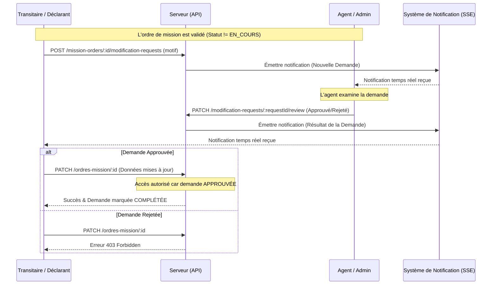

# Documentation - Système de Demandes de Rectification

Ce document décrit le flux opérationnel et technique du système de demandes de rectification des ordres de mission.

## Flux de Travail (Workflow)



## Étapes Détaillées

### 1. Création de la demande
Le transitaire ne peut plus modifier directement un ordre de mission une fois qu'il est validé (statut différent de `EN_COURS`). Il doit soumettre une demande via `POST /mission-orders/:id/modification-requests`.

### 2. Notification des agents
Dès la création, une notification de type `INFO` est générée. Les agents connectés au flux SSE (`GET /notifications/sse`) reçoivent l'alerte instantanément.

### 3. Révision par l'agent
Un agent ou administrateur examine le motif. Il peut :
- **Approuver** : Déverrouille temporairement le droit de modification pour cet ordre spécifique.
- **Rejeter** : Maintient le verrouillage avec un motif d'explication.

### 4. Application de la modification
Si approuvée, le transitaire peut appeler `PATCH /ordres-mission/:id`.
Techniquement, le `OrdreMissionService` vérifie la dernière demande associée :
- Si `latestModificationRequest.status === APPROVED`, la transaction Prisma procède à l'update.
- La demande est ensuite marquée comme `COMPLETED` pour éviter les réutilisations.

## Sécurité Technique

La sécurité est implémentée au niveau du service NestJS :

```typescript
// Extrait de OrdreMissionService.update
if (currentUser.role === 'TRANSITAIRE' || currentUser.role === 'DECLARANT') {
    const latestRequest = ordreMissionCheck.modificationRequests[0];
    const isApproved = latestRequest && latestRequest.status === ModificationRequestStatus.APPROVED;

    if (ordreMissionCheck.statut !== 'EN_COURS' && !isApproved) {
        throw new ForbiddenException(
            "Vous ne pouvez pas modifier cet ordre de mission. Veuillez soumettre une demande de rectification.",
        );
    }
}
```
